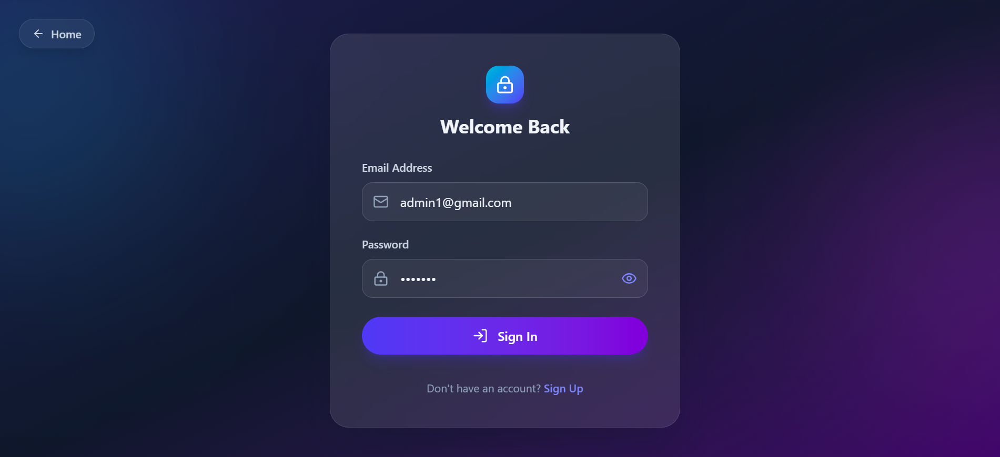
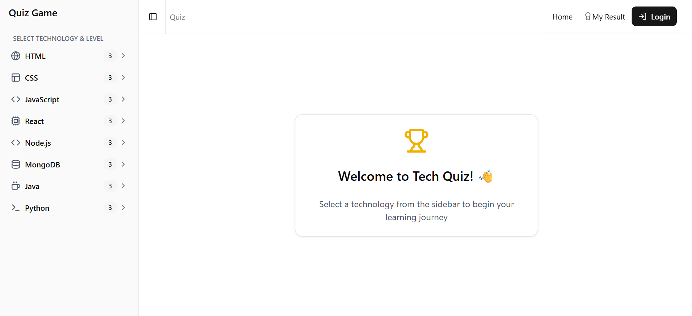
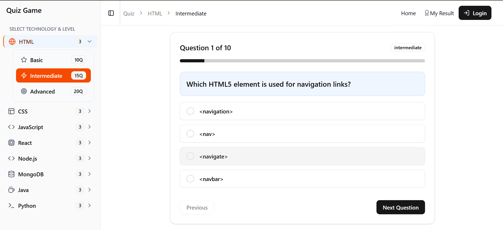
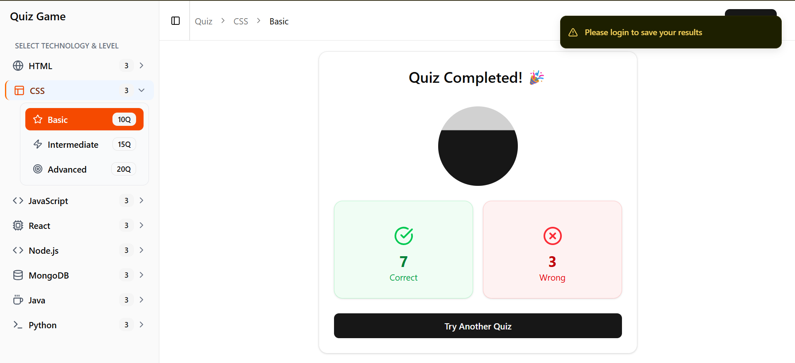
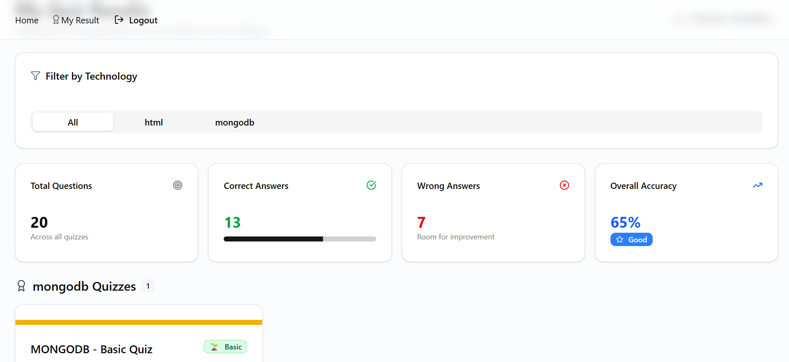
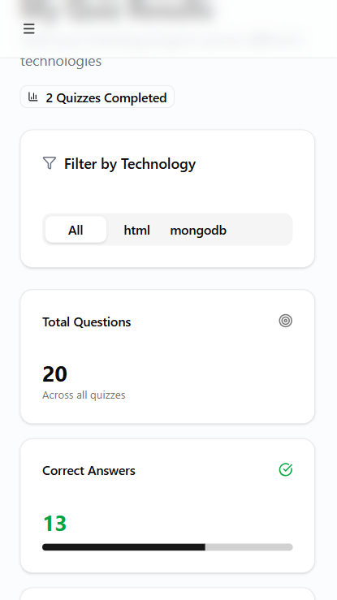
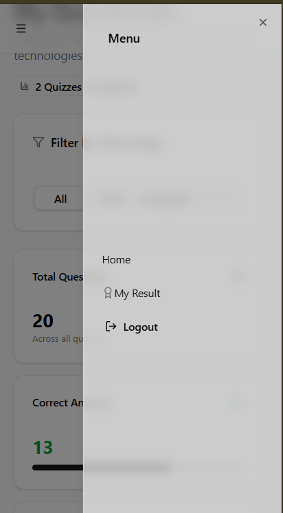
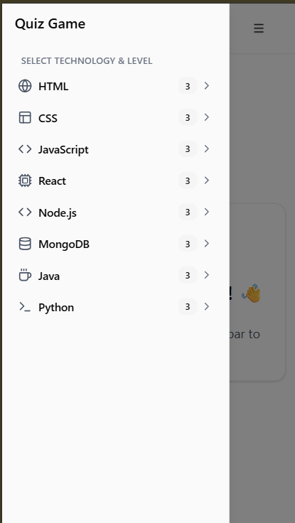

# 🎯 Tech Quiz Application

A modern, interactive quiz application built with React and shadcn/ui that helps users test their knowledge across various programming technologies and track their learning progress.

## 🖥️ Desktop View

  
  
  
  


---

## ✨ Features

### 🎮 Interactive Quiz System

- **8 Technology Tracks**: HTML, CSS, JavaScript, React, Node.js, MongoDB, Java, and Python
- **3 Difficulty Levels**: Basic, Intermediate, and Advanced
- **240+ Questions**: Comprehensive question bank with 30 questions per technology
- **Instant Feedback**: See correct/wrong answers immediately after selection
- **Progress Tracking**: Visual progress bar showing quiz completion

### 📊 Results & Analytics

- **Detailed Results**: View scores, accuracy percentages, and performance badges
- **Result History**: Track all your quiz attempts over time
- **Technology Filtering**: Filter results by specific technologies
- **Performance Badges**: Earn badges based on your score (Excellent, Good, Average, Needs Work)
- **Summary Statistics**: Overall performance metrics across all quizzes

### 🎨 Modern UI/UX

- **Responsive Design**: Works seamlessly on desktop, tablet, and mobile devices
- **Collapsible Sidebar**: Easy navigation between technologies and levels
- **Breadcrumb Navigation**: Always know where you are in the app
- **Loading States**: Skeleton loaders for better user experience
- **Toast Notifications**: Real-time feedback for user actions

### 🔐 User Features

- **Authentication System**: Secure login/signup functionality
- **Persistent Results**: Save quiz results to your account
- **Guest Mode**: Take quizzes without logging in (results won't be saved)

---

## 🛠️ Tech Stack

### Frontend

- **React 18** – UI library
- **Vite** – Build tool and dev server
- **shadcn/ui** – UI component library
- **Tailwind CSS** – Utility-first CSS framework
- **React Router v6** – Client-side routing
- **Axios** – HTTP client
- **Lucide React** – Icon library
- **Sonner** – Toast notifications

### Backend

- **Node.js** – Runtime environment
- **Express.js** – Web framework
- **MongoDB** – Database
- **JWT** – Authentication

---

## 📦 Installation

### Prerequisites

- Node.js 16+ installed
- npm or yarn package manager
- MongoDB instance (local or cloud)
- Git

### 1. Clone the Repository

```bash
git clone https://github.com/theabdulla0/Quiz-Game.git
cd Quiz-Game
```

### 2. Install Dependencies

```bash
# Frontend
cd frontend
npm install

# Backend
cd ../backend
npm install
```

### 3. Run the Development Server

```bash
# In both frontend and backend directories
npm run dev
```

### 4. Build for Production

```bash
npm run build
```

---

## 📱 Mobile View

  
  

